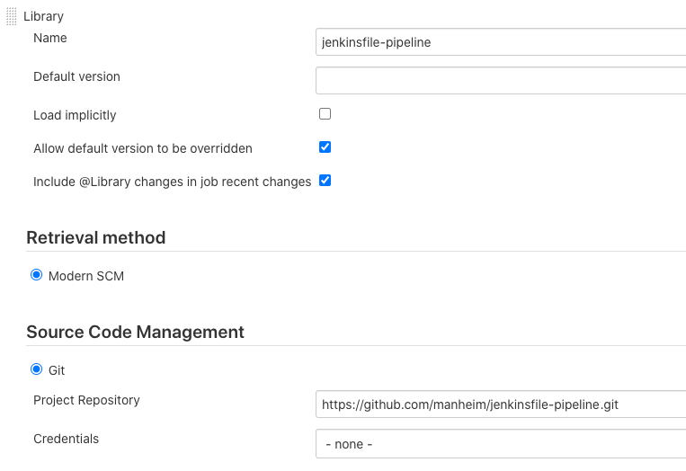
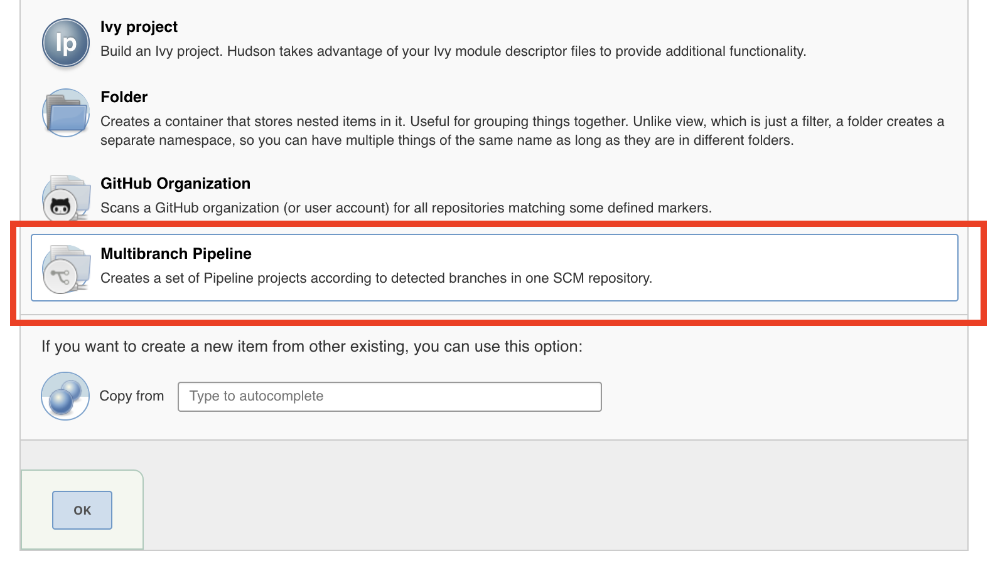
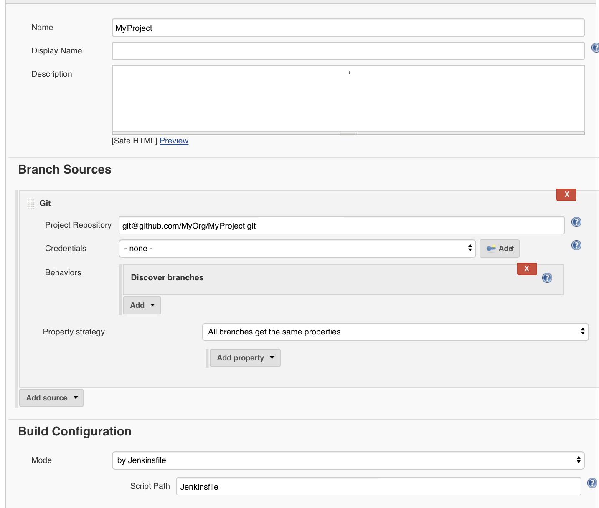

[](https://travis-ci.org/manheim/jenkinsfile-pipeline) [](https://codecov.io/gh/manheim/jenkinsfile-pipeline)


# jenkinsfile-pipeline
A reusable pipeline template to build and deploy an application serially across multiple environments, using [Jenkins](https://www.jenkins.io/) and [Jenkinsfile](https://www.jenkins.io/doc/book/pipeline/jenkinsfile/).

# Requirements and Assumptions
1.  Your application source code is available in a git repo.
2.  You have an application that can be built in some way.  By default, you can provide a `./bin/build.sh` to build your artifact.
3.  Your application artifact can be deployed to an environment in some way.  By default, you can provide a `./bin/deploy.sh` to deploy your artifact.  `./bin/deploy.sh` should accept the name of your environment as the first argument.
4.  You've imported jenkinsfile-pipeline to your Jenkins instance.


# How to Use
1.  Create a Jenkinsfile in your application project and import the [version](https://github.com/manheim/jenkinsfile-pipeline/releases) of jenkinsfile-pipeline that you want to use.  It's recommended that you always use the latest version.
```
// Jenkinsfile
@Library('jenkinsfile-pipeline@<VERSION>') _
```
2. Provide jenkinsfile-pipeline with a reference to the Jenkinsfile context, so that it can do all of it's magic under the hood.
```
// Jenkinsfile
...
Jenkinsfile.init(this)
```
3.  Create a pipeline.  In this case, we'll make it Scripted.
```
def pipeline = new ScriptedPipeline()
```
4.  Create a stage to build your deployment artifact.
```
// Jenkinsfile
...
def buildArtifact = new BuildStage()
```
5.  Create a stage to deploy to each of your environments.  This example creates stages to deploy to qa, uat, and prod environments.  The number and names of your environments can differ from this example.  Choose the environments and environment names that reflect your own development process to go from Code to Customer.
```
// Jenkinsfile
...
def deployQa = new DeployStage('qa')
def deployUat = new DeployStage('uat')
def deployProd = new DeployStage('prod')
```
6.  Link the Stages together in your pipeline in the order that you want them to run.  This examples builds your deployment artifact, then deploys qa, then uat, then prod.  Each step *MUST* succeed before it can proceed on to the next.
```
// Jenkinsfile
...
pipeline.startsWith(buildArtifact)
        .then(deployQa)
        .then(deployUat)
        .then(deployProd)
```
7.  The design of this library is influenced by the [Builder Pattern](https://en.wikipedia.org/wiki/Builder_pattern) - your pipeline has been configured, but hasn't been constructed just yet.  Finalize and create your pipeline by calling the `build()` method.  This should only be done once - no code should come after calling this method.
```
// Jenkinsfile
...
        .build()
```

8.  From beginning to end, your Jenkinsfile should roughly look like this:

```
@Library('jenkinsfile-pipeline@<VERSION>') _

Jenkinsfile.init(this)

def pipeline = new ScriptedPipeline()
def buildArtifact = new BuildStage()
def deployQa = new DeployStage('qa')
def deployUat = new DeployStage('uat')
def deployProd = new DeployStage('prod')

pipeline.startsWith(buildArtifact)
        .then(deployQa)
        .then(deployUat)
        .then(deployProd)
        .build()
```

9.  Load your project into Jenkins, and point it to your newly created Jenkinsfile.
    1. Create a new job using the 'New Item' menu

       
    2. Select Multibranch Pipeline after naming your new job

       
    3. Configure your new job, and point it to the location of your source code.

       

10.  If everything was successful, you should see something like this:


# Customizing Your Pipeline With Plugins

The example above gives you a bare-bones pipeline, and there may be Jenkinsfile features that you'd like to take advantage of.  Some of these features have been pre-defined as Plugins for this library.  Pre-defined plugins can be enabled by simply calling their static `init()` method.

### Build Artifact Management
* [StashUnstashPlugin](./docs/StashUnstashPlugin.md): Stash your artifact after BuildStage, and unstash it for each of your subsequent DeployStages.

### Credentials and Configuration Management
* [CredentialsPlugin](./docs/CredentialsPlugin.md): Inject Jenkins credentials into your stages.
* [ParameterStorePlugin](./docs/ParameterStorePlugin.md): Inject environment variables from ParameterStore parameters.

### IAM Role Management
* [WithAwsPlugin](./docs/WithAwsPlugin.md): Use `withAws` to assume different IAM roles during deployment.

### Workflow Management
* [ConfirmBeforeDeployPlugin](./docs/ConfirmBeforeDeployPlugin.md): Optionally wait for confirmation before deploying

# Control Where Your Jobs Are Run

By default, the pipeline jobs are not assigned to a particular Jenkins node.  If you want to tie your pipeline to particular Jenkins node label, you can do so with the following line of code:

```
def pipeline = new ScriptedPipeline().withNodeLabel('mylabel')
```

# [DRY'ing](https://en.wikipedia.org/wiki/Don%27t_repeat_yourself) your Plugin configuration

It's likely that you'll use a number of different Plugins for your particular application's pipeline.  It's also likely that you'll have a number of different applications using jenkinsfile-pipeline, and many of these applications may share the same plugin configuration.  Rather than duplicate and clutter your Jenkinsfile with these details, it may help to group all of your Plugin initialization into a single class, and share that class across your pipelines with a shared library.

1. Create a new repository for the shared library.  You can pick any name - in this example, we'll use `jenkinsfile-pipeline-customizations`.
2. In that repository, create a new file called `Customizations.groovy`.
3. Create a static `init()` method in your class, and add your Plugin configuration there.  In the example below, the Customization will enable the `ParameterStorePlugin`, and the `WithAwsPlugin`.
```
// Customizations.groovy

class Customizations {
    public static void init() {
        ParameterStorePlugin.init()
        WithAwsPlugin.init()
    }
}
```
4. Load your repository as a shared library (See: [Using Libraries](https://jenkins.io/doc/book/pipeline/shared-libraries/)).  Be sure to version your library, to maintain control over how changes propagate across your pipelines.
5. Import your shared library, just like you imported jenkinsfile-pipeline.
6. Call the `Customizations.init()` method in your pipeline to initialize your plugins.
```
// Jenkinsfile
@Library('jenkinsfile-pipeline@<VERSION>', 'jenkinsfile-pipeline-customizations@<VERSION>') _

Customizations.init()
Jenkinsfile.init()

def pipeline = new ScriptedPipeline(this)
def buildArtifact = new BuildStage()
def deployQa = new DeployStage('qa')
def deployUat = new DeployStage('uat')
def deployProd = new DeployStage('prod')

pipeline.startsWith(buildArtifact)
        .then(deployQa)
        .then(deployUat)
        .then(deployProd)
        .build()
```
7. Repeat Step 5-6 above for every project that you want to apply the same set of Plugins/Customizations to.
8. If you have multiple groups of pipelines that require different groups of plugins, you can create multiple Customization libraries with unique names.  Eg: `jenkinsfile-pipeline-lambda-customizations`.
```
// Jenkinsfile
@Library('jenkinsfile-pipeline@<VERSION>', 'jenkinsfile-pipeline-lambda-customizations@<VERSION>') _

Customizations.init()
Jenkinsfile.init()

def pipeline = new ScriptedPipeline(this)
def buildArtifact = new BuildStage()
def deployQa = new DeployStage('qa')
def deployUat = new DeployStage('uat')
def deployProd = new DeployStage('prod')

pipeline.startsWith(buildArtifact)
        .then(deployQa)
        .then(deployUat)
        .then(deployProd)
        .build()
```

# Goals that this library is trying to achieve:

1.  Application code should be written once, and should be reusable for all environments.
    1.  Configuration, especially environment-specific configuration, should be externalized.  Where it's externalized to should be irrelevant.
2.  As much as possible, a pipeline should reflect what teams do to get from Code to Customer - no more, but also no less.
    1.  Allow teams to specify their own steps in that process, and teams should choose how those steps are linked together.
    2.  This is an OpenSource project - defaults should make reasonable sense for anyone that happens to use this project.
3.  Apply the [Open/Closed Principle](https://en.wikipedia.org/wiki/Open%E2%80%93closed_principle)
    1.  You should rarely need to change the base code, everything should be open for extension without modification to the base code.
    2.  It should be possible to add behaviors through Plugins and Decorations - this makes behavior addable/removable/extenable.
    3.  Think of plugins as interchangeable Lego pieces - you can swap one piece out for another, without fundamentally altering what it is to be a Pipeline.

